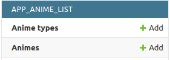
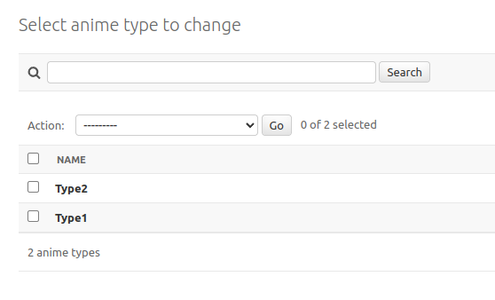
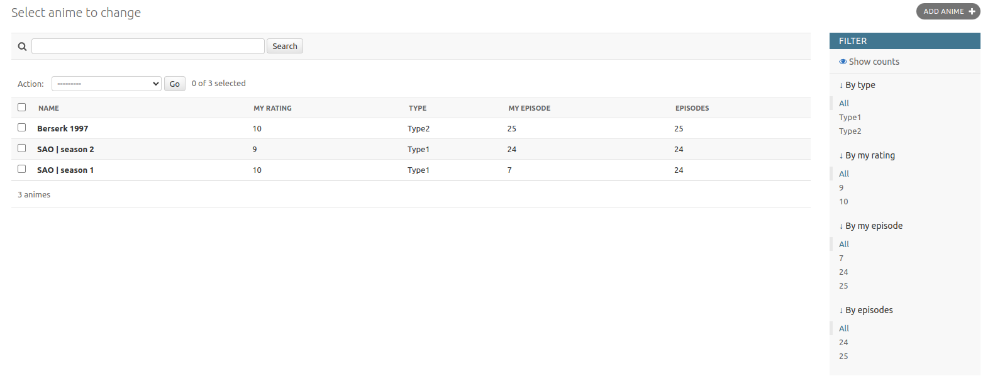
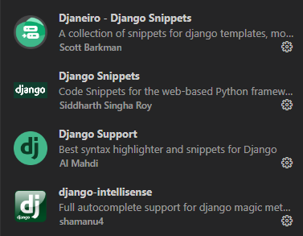
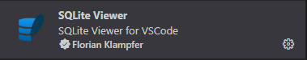

# Django Start Урок №12 Створення адмін-панелі.


В цьому завданні ми зробимо адмінську панель і давай розпочнемо з простого.

## Проект вже частково створений, проте для початку, давай створимо віртуальну машину або ж іншими словами `venv`. Для цього пропиши наступні команди

# Windows
```python
python -m venv venv
venv/Scripts/Activate.ps1
```

# Linux or MAC
```python
python3 -m venv venv
source venv/bin/activate
```

Після чого тобі потрібно встановити Djnago, але крім нього проект може потребувати щось ще, тому пишемо в консоль вже відому нам команду `pip install -r requirements.txt`.

Не забудь також зареєструвати апку `app_anime_list` як ми це робили на уроці при її створенні!

Далі створи модельку `AnimeType` в якого буде одне поле:
* `name` - `CharField` з максимальною довжиною `63`, воно повинно бути `unique`, і не бути пустим
Також налаштуй строкову репрезентацію тут вона повинна виводити просто name

```python
AnimeType(name="SAO")

# SAO     <- саме так воно повинно буде відображатись в адмінці
```

Наступним кроком створи модельку `Anime`, з наступними полями:
* `name` - скопіюй його з модельки `AnimeType`, але зміни макс. довжину на `255`;
* `description` - `TextField`, також це полем може бути пистим;
* `type` - `ForeignKey`, Де ми посилаэмося на `AnimeType` все як на уроці;
* `episodes` - `PositiveIntegerField`, може бути пустим;
* `my_episode` - `PositiveIntegerField`, Не можу бути пустим, тут ми будемо зберігати на якому епізоді ми закінчили;
* `my_rating` - `PositiveIntegerField`, не може бути пустим, тут ми будемо проставляти наш рейтинг для аніме;

Далі вводимо 2 команди:
1) `python manage.py makemigrations` - Для створення міграцій
2) `python manage.py migrate` - Для запуску міграцій

Також команди, які вам необхідні:
1) `python manage.py runserver` - Для запуску сервера
2) `python manage.py createsuperuser` - Для свторення адміна яким ви зайдете в адмінку
3) `python manage.py test` - Для запуску тестів!
4) Команди для GIT знайдете в попередніх домашках.
# При завершенні завдання обов'язково запустіть тести для само перевірки!

```python
Anime(
    name="My Anime",
    description="Anime description",
    type=self.anime_type,  # <- Shounen тут це type або ж жанр аніме
    episodes=12,
    my_episode=5,
    my_rating=8,
)

# My Anime Rating: 8 Shounen | 5/12    <- саме так воно повинно буде відображатись в адмінці
```

# Тепер переходимо до Адмінки:
Для `AnimeType` налаштуй пошук і сортування по полю `name`;

Для `Anime` налаштуй:
* `Пошук` - по `name`;
* `Сортування` - по `name`, `my_rating`, `type`, `my_episode` & `episodes`;
* `Фільтрування` - по , `type`, `my_rating`, `my_episode` & `episodes`;


# Приблизно таким має бути ваш результат.




# Екстеншени в VS Code, які рекомендував скачати.


