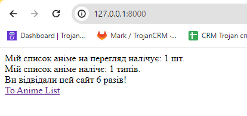
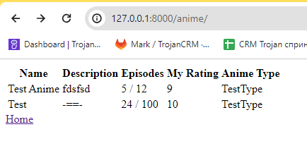

# Django Start Урок №13 Views & Templates.


В цьому завданні ми зробимо примітивну домашню сторінку з посиланнями і списком аніме.

## Проект вже частково створений, проте для початку, давай створимо віртуальну машину або ж іншими словами `venv`. Для цього пропиши наступні команди

# Windows
```python
python -m venv venv
venv/Scripts/Activate.ps1
```

# Linux or MAC
```python
python3 -m venv venv
source venv/bin/activate
```

Після чого тобі потрібно встановити Djnago, але крім нього проект може потребувати щось ще, тому пишемо в консоль вже відому нам команду `pip install -r requirements.txt`.

Далі те що ми тепер будемо робити завжди:
1) Введи команду для створення бд `python manage.py migrate`
2) Введи команду для завантаження данних в бд щоб вона не була пуста`python manage.py loaddata data.json`

# =====index view====

Для початку створимо view `index`. Вона точно такаж як і на уроці але тут ми звісно, показуємо к-ть аніме і їх типів.

Вона повинна виводити такі аргументи:
* `num_anime` - Рахуємо загальну к-ть аніме;
* `num_anime_types` - Рахуємо загальну к-ть типів аніме по жанрам;
* `num_visits` - К-ть відвідувань користувача нашого сайту;

Далі робимо для них темплейти(html файли):
* Створіть папку `templates`;
* В папці `templates` створіть папку `app_anime_list`;
* В папці `app_anime_list` створіть файл `index.html` в якому вам потрібно повторити результат на скріні;

# Важливо текст з скріна повинен співпадати з вашим бо його будуть шукати тести!!!
# Не забудь зереєструвати для ціє view `urls.py` як і для наступної і також зареєструвати посилання апки `app_anime_list` в `config/urls.py`


# ====AnimeListView====

Далі робимо view `AnimeListView` яка буде показувати нам наш список аніме.
* В папці `app_anime_list` створіть файл `anime_list.html` в якому вам потрібно повторити результат на скріні;
* Якщо опису нимає виводимо `-==-` це також будть первіряти тести;



# ====Кнопки навігації====

І не забудьте додати кнопки(ссилки) якими ви будете пригати між сторінками index.html & anime_list.html


Також команди, які вам необхідні:
1) `python manage.py runserver` - Для запуску сервера
2) `python manage.py createsuperuser` - Для свторення адміна яким ви зайдете в адмінку
3) `python manage.py test` - Для запуску тестів!
4) Команди для GIT знайдете в попередніх домашках.
# При завершенні завдання обов'язково запустіть тести для само перевірки!

